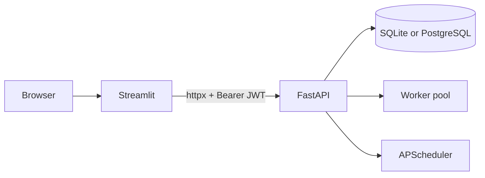

# Architecture

## Runtime topology

- **FastAPI** is the only authority for auth, authorization, persistence, execution, and scheduling.
- **Streamlit** is an HTTP client. It must not import ORM models, open the database, decrypt tokens, run pipelines, or touch APScheduler.
- **Runner** executes queued pipeline runs in a bounded in-process thread pool (`ETLANTIC_MAX_WORKERS`).
- **Scheduler** restores enabled schedules into APScheduler on API startup.

## Trust boundaries

| Layer | Holds |
| --- | --- |
| FastAPI env | `ETLANTIC_JWT_SECRET`, `ETLANTIC_TOKEN_ENCRYPTION_KEY`, database URL |
| Streamlit env | `ETLANTIC_UI_API_URL`, timeouts, poll interval only |
| Browser / Streamlit session | Access JWT (short-lived), never passwords or API-token plaintext after submit |
| Database | Password hashes, Fernet ciphertext for API tokens, SHA-256 hashes of invite tokens |

## Pipeline document integrity

1. Clients submit ETLantic `etlantic.pipeline/1` documents.
2. The API verifies/seals via ETLantic authoring (`POST /pipelines/verify-draft` or create/update paths).
3. Stored rows keep `document`, `fingerprint`, and `version`.
4. Each run snapshots document + version + fingerprint so later edits cannot rewrite history.

## Secret resolution at run time

1. Users store secrets once via `POST /tokens` (encrypted at rest).
2. Grants bind a token to a pipeline asset (`binding` + `operation`).
3. Plans carry only a `user-tokens` secret reference, never plaintext.
4. During execution, an owner-scoped provider decrypts just-in-time into an ETLantic `SecretValue` that refuses serialization into reports/logs.

## Collaboration model

- **Ownership** stays with the pipeline creator (`can_delete`, unshare).
- **Group membership** grants edit/validate/plan/run/schedule on shared pipelines.
- Responses include `access_source` (`owned` \| `group`) and `shared_group_ids` so UIs do not N+1 group lookups.
- Group responses include `current_user_role` (`owner` \| `member`).

## Scaling limits

This design targets a **single API process**. See [Deployment](deployment.md).
