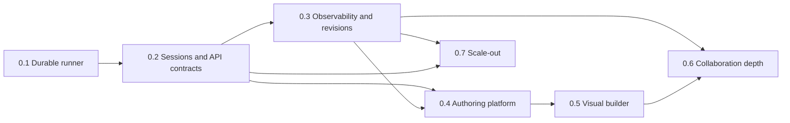

# Roadmap

Versioned plan for the ETLantic FastAPI runner example. Phases use **0.X**
semver so each milestone can ship as a `0.X.0` release (or a patch train on the
current minor). Status reflects the tree after the `0.1.0` application and
Streamlit UI were delivered. Every phase follows
[Planning and Delivery Standards](delivery-standards.md).

| Phase | Theme | Status |
| --- | --- | --- |
| [0.1](#01--durable-runner-mvp) | Durable runner MVP | **Shipped** |
| [0.2](#02--api-ergonomics--sessions) | API ergonomics and sessions | Planned |
| [0.3](#03--observability--ops) | Observability and ops | Planned |
| [0.4](#04--authoring-platform) | Authoring platform | Planned |
| [0.5](#05--visual-pipeline-builder) | Visual pipeline builder | Proposed |
| [0.6](#06--collaboration-depth) | Collaboration depth | Planned |
| [0.7](#07--scale-out-foundation) | Scale-out foundation | Later |

Detailed UI delivery history lives in
[streamlit-frontend.md](streamlit-frontend.md). Product docs live under
[`docs/`](../README.md).

## Dependency path

Phases describe capability dependencies, not a requirement that every feature
ship in one large branch. Prefer vertical patch releases that satisfy one
documented slice and preserve compatibility.

---

## 0.1 — Durable runner MVP

**Status:** Shipped (`0.1.0`)

Single-process FastAPI authority for auth, persistence, execution, and
scheduling, plus an HTTP-only Streamlit client for non-admin workflows.

### Shipped capabilities

- JWT auth, Argon2 passwords, Alembic migrations, SQLite by default
- Sealed `etlantic.pipeline/1` documents with fingerprint + optimistic version
- Validate, plan, edit, run, and schedule pipelines
- Encrypted API-token vault with per-pipeline asset grants
- Groups, hashed one-time invitations, shared pipeline access
- Access metadata on pipelines/groups (`access_source`, `can_delete`,
  `current_user_role`, `shared_group_ids`)
- Draft verification endpoints (`POST /pipelines/verify-draft`,
  `POST /pipelines/{id}/verify-draft`)
- Streamlit UI (auth, pipelines, runs, schedules, tokens, groups, account)
- Docs directory, dual-process local run story

### Explicit non-goals (still true)

- Horizontally scaled runner/scheduler without extra design
- Email delivery for invitations
- Node-and-edge visual designer
- Multi-user live co-editing

---

## 0.2 — API ergonomics and sessions

**Status:** Planned · next minor

Detailed plan:
[API Ergonomics and Sessions](api-ergonomics-sessions.md).

Make the HTTP contract friendlier for long sessions and list-heavy UIs without
changing the single-process execution model.

### Deliverables

1. **Refresh tokens or session exchange** — short-lived access JWTs without
   forcing a full password login every `ETLANTIC_ACCESS_TOKEN_MINUTES`.
2. **Pagination envelopes** — `{items, total, limit, offset}` (or cursor) for
   pipelines, runs, schedules, tokens, groups, and admin user lists.
3. **Stable problem details** — consistent error envelope with `code`,
   `message`, optional field/path, and request ID.
4. **Idempotency keys** — safe retries for create, invite, run, and schedule
   mutations.
5. **UI + client updates** — Streamlit and `EtlanticApiClient` consume the new
   envelopes; OpenAPI drift tests stay green.

### Exit criteria

- Access tokens remain short-lived; refresh/session path is documented.
- List endpoints return totals the UI can page against.
- Failed mutations return a stable machine-readable error shape.
- Refresh rotation/reuse, cursor integrity, and idempotent retry pass their
  dedicated security and concurrency test matrices.
- Migration from the shipped 0.1 database and client compatibility are proven.

---

## 0.3 — Observability and ops

**Status:** Planned

Detailed plan:
[Observability and Operations](observability-operations.md).

Make runs and production operation inspectable and safer to deploy.

### Deliverables

1. **Run cancellation** — cancel queued/running work with a clear terminal
   status.
2. **Server-driven progress** — SSE or WebSocket run events (polling remains as
   fallback).
3. **Audit events** — durable record of membership changes, pipeline edits,
   credential grants, runs, schedules, and destructive actions.
4. **Pipeline revision history** — store each saved revision; support compare
   and restore.
5. **Ops docs** — PostgreSQL checklist, logging redaction, readiness probes,
   and single-leader scheduler notes expanded in [deployment.md](../deployment.md).

### Exit criteria

- A user can cancel a run from API and Streamlit.
- Audit trail covers invite/accept, share/unshare, token grant, and delete.
- Revision restore does not silently drop the previous fingerprint/version
  chain.
- Run events reconnect without gaps or secret-bearing payloads.
- Readiness, restart recovery, redaction, and incident runbooks pass the
  detailed operational release gates.

---

## 0.4 — Authoring platform

**Status:** Planned · prerequisite for visual builder

Detailed plan: [Authoring Platform](authoring-platform.md).

Expose ETLantic authoring surfaces the UI needs beyond raw JSON editing.

### Deliverables

1. **Authoring catalog / negotiation** — backends list supported sources,
   sinks, transforms, and edit commands.
2. **Typed edit schemas** — OpenAPI-friendly shapes for structured
   `POST /pipelines/{id}/edits` (and drafts).
3. **Richer draft diagnostics** — verify-draft returns field/path-aligned
   diagnostics suitable for overlays.
4. **UI structured editor** — optional form-driven edits alongside JSON, still
   HTTP-only.

### Exit criteria

- Catalog endpoints are covered by API tests and OpenAPI drift checks.
- A non-JSON edit path can create a valid sealed document end-to-end.
- Atomic drafts and typed edits are conflict-safe, resource-bounded, and
  parity-tested against the pinned ETLantic PyPI package.
- Catalog, diagnostics, and draft payloads contain no executable or
  secret-bearing values.

---

## 0.5 — Visual pipeline builder

**Status:** Proposed · detailed product plan ready

See the full
[Visual Pipeline Builder Product and Delivery Plan](visual-pipeline-builder.md)
for the interaction model, draft architecture, accessibility requirements,
backend contracts, testing strategy, product metrics, and 0.5.x release gates.

Node-and-edge authoring on top of the 0.4 catalog.

### Prerequisites

- 0.4 authoring catalog and edit schemas
- Stable draft sealing/fingerprinting (already in 0.1; keep hardening)
- Chosen graph-editor component and maintenance/security posture

### Deliverables

- Guided recipe, source-first, blank-canvas, and JSON-import entry paths
- Searchable catalog, typed ports, compatibility-aware connections, property
  inspector, data mapping, and credential-grant flows
- Localized diagnostics, readable plans, and live run/failure overlays
- Recoverable server-side drafts, undo/redo, explicit version commits, revision
  history, and safe conflict resolution
- Accessible Outline view and keyboard equivalent for every graph operation
- Lossless graph ↔ canonical JSON round-trip
- Save only through backend ETLantic authoring operations

### Exit criteria

- Users can build a supported pipeline without hand-writing JSON.
- Graph saves never bypass fingerprint/version checks.
- Refresh or reconnect does not lose a server-accepted edit.
- Concurrent edits cannot silently overwrite another revision.
- Target users meet the plan's usability, accessibility, secret-safety, and
  interaction-performance gates.

---

## 0.6 — Collaboration depth

**Status:** Planned after revisioned visual authoring foundations

Detailed plan: [Collaboration Depth](collaboration-depth.md).

Move groups from “share a link token” toward operable team workflows.

### Deliverables

1. **Invitation delivery** — backend email (or other channel) for acceptance
   links; stop returning raw invite tokens to general UI once delivery exists.
2. **Richer roles** — beyond owner/member if needed (e.g. viewer vs editor).
3. **Share UX** — clearer owned vs shared affordances; bulk share/unshare.
4. **Optional presence** — soft “someone else may be editing” hints (not full
   CRDT co-editing).

### Exit criteria

- Invitation flow works without copying a raw token from the API response in
  the default path.
- Role checks remain enforced only on the FastAPI side.
- Endpoint-level permission tests cover every role and sensitive operation.
- Access removal, ownership transfer, concurrent editing, and invitation
  delivery pass the detailed race/security gates.

---

## 0.7 — Scale-out foundation

**Status:** Later

Detailed plan: [Scale-Out Foundation](scale-out-foundation.md).

Graduate the example past a single in-process runner/scheduler when needed.

### Deliverables

1. **PostgreSQL-first defaults** for multi-process deployments
2. **Dedicated worker** (or leader election) for APScheduler + run pool so API
   replicas do not duplicate jobs
3. **Queue backing** for runs (DB lease, Redis, or similar) with clear
   ownership
4. **Deployment reference** — compose/k8s sketch keeping JWT/Fernet secrets
   only on the API/worker side

### Exit criteria

- Two API replicas do not double-fire the same schedule.
- Streamlit still talks only over HTTP with `ETLANTIC_UI_*` settings.
- Worker leases are fenced, accepted runs cannot enter limbo, and crash
  injection validates the documented at-least-once attempt semantics.
- PostgreSQL migration/restore and rolling-version compatibility are rehearsed.

---

## Out of scope (for 0.x)

These stay explicit non-goals unless promoted in a future major:

- Multi-tenant SaaS control plane / billing
- Replacing FastAPI as the authz authority
- Decrypting or logging API-token plaintext in the UI
- Running pipelines inside the Streamlit process
- Full CRDT / live collaborative editing

---

## How to use this doc

- Prefer small PRs that land one phase bullet or a coherent slice.
- When a phase ships, bump `project.version` in `pyproject.toml` and mark the
  phase **Shipped** here.
- Keep implementation detail in focused plans under `docs/plans/`; keep this
  file as the versioned index of intent.
- Apply [delivery-standards.md](delivery-standards.md) definitions of ready and
  shipped; a passing unit suite alone does not ship a phase.
