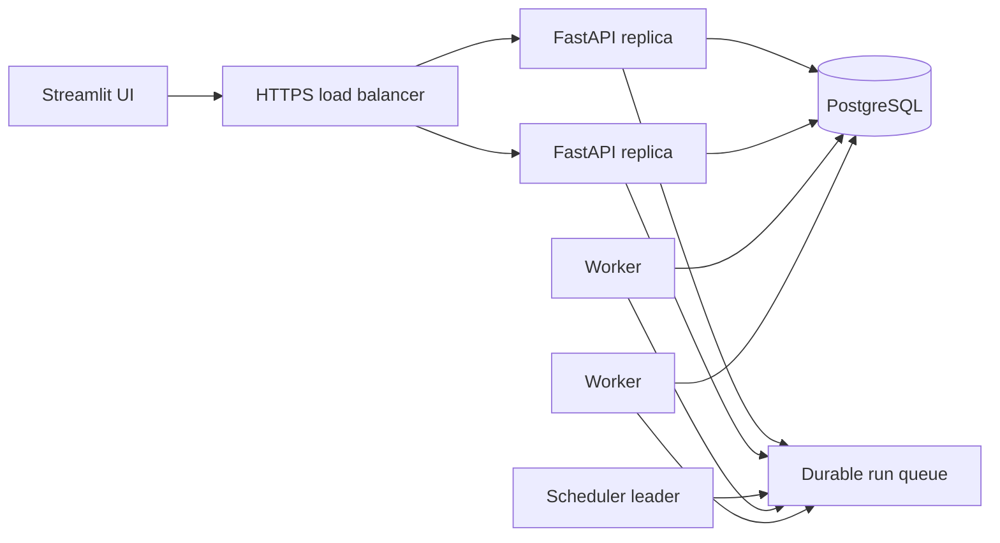

# Scale-Out Foundation Plan

> **Roadmap:** 0.7  
> **Status:** Later · requires an explicit production-scale decision  
> **Depends on:** Durable sessions, observability, cancellation, idempotency,
> and revisioned authoring  
> **Goal:** Run multiple API instances and independent workers without duplicate
> schedules, lost jobs, or accidental secret distribution.

This phase completes the multi-worker slices of
[Durable Run Recovery](durable-run-recovery.md); it must reuse that run/attempt
state machine rather than introduce a second queue model.

## Target topology

API, scheduler, and worker become separate process roles. Streamlit remains an
HTTP client and never receives database, JWT-signing, token-encryption, queue,
or worker secrets it does not need.

## Delivery decision

Before implementation, record an ADR selecting:

- queue/lease approach: PostgreSQL-backed leases first or a dedicated broker;
- scheduler leadership mechanism;
- run delivery guarantee and retry semantics;
- supported deployment target;
- secret distribution/rotation method;
- minimum PostgreSQL and Python versions.

Prefer the smallest design that meets measured load and recovery requirements.
Do not add Redis/Kafka/Celery solely for architectural appearance.

## PostgreSQL transition

- Make PostgreSQL the reference production database while retaining SQLite for
  single-process development/tests.
- Audit SQLite-specific assumptions, timezone behavior, JSON querying, locking,
  foreign keys, transaction isolation, and Alembic types.
- Add PostgreSQL integration tests and migration-from-current-schema tests.
- Define backup, restore, point-in-time recovery, connection pool, statement
  timeout, and migration locking procedures.
- Use expand/migrate/contract deployments for changes crossing multiple
  concurrently running versions.

## Durable queue and leases

A logical run is inserted transactionally before queue publication. Workers:

- claim with an atomic lease and fencing token;
- heartbeat while running;
- renew within a bounded interval;
- stop committing results after losing the lease;
- make terminal transition conditional on the fencing token;
- recover expired leases according to retry policy;
- keep attempt history and stable logical run identity.

Submission uses idempotency keys. The system promises at-least-once attempt
delivery with fenced, idempotent state transitions—not magical exactly-once
external side effects. Pipeline connectors must document idempotency and write
semantics.

Cancellation marks intent durably and signals the lease holder. Workers check
cancellation between safe execution boundaries.

## Scheduler leadership

- Exactly one active scheduler leader enqueues due occurrences.
- Leadership uses a database advisory lock or renewable lease with fencing.
- Each scheduled occurrence has a deterministic uniqueness key derived from
  schedule ID and intended fire time.
- Enqueue is idempotent under leader failover.
- Define misfire, coalescing, timezone/DST, clock skew, and catch-up behavior.
- Readiness for the scheduler role reports leadership/standby state separately.

## Secrets and workers

- Workers receive only the grants required for the claimed run.
- Decryption happens at the latest practical point and plaintext remains
  process-memory-only.
- Queue messages contain references, never API-token plaintext or encryption
  keys.
- Key rotation supports decrypt-old/encrypt-new during a bounded transition.
- Redaction canaries run through API, queue, worker logs, events, reports, and
  failure paths.
- Worker/plugin allowlists prevent a pipeline from selecting an unapproved
  implementation.

## API and event delivery

- API replicas are stateless except for shared durable stores.
- Refresh sessions, idempotency records, drafts, rate limits where correctness
  matters, and SSE event cursors use shared state.
- Run events are durable enough for reconnect from any replica.
- Backpressure bounds slow SSE consumers and polling endpoints.
- Read-after-write consistency expectations are documented.

## Deployment and operations

Provide a reference Compose deployment first; add Kubernetes manifests only if
maintained and continuously tested.

- separate API, Streamlit, scheduler, worker, migration, and PostgreSQL roles;
- readiness/liveness and graceful shutdown for each;
- migration job runs once before incompatible application rollout;
- pod/process disruption and worker drain behavior;
- autoscaling inputs based on queue age/depth and worker saturation;
- resource limits and per-run timeout/concurrency controls;
- backup/restore and disaster-recovery exercises;
- version-skew compatibility matrix.

## Failure scenarios

Design and test:

- API dies after DB insert but before queue publish;
- worker dies before/after external write and before terminal commit;
- lease expires during a long node;
- scheduler leader partitions or pauses;
- PostgreSQL failover;
- queue unavailable/backlogged;
- duplicate delivery;
- deployment with old and new workers;
- token rotation during a run;
- region/host clock skew.

Use an outbox or database queue so the DB/queue publication boundary cannot
lose accepted runs.

## Test strategy

- PostgreSQL unit/integration suite in CI;
- migration from populated current release and rollback rehearsal;
- lease/fencing property tests;
- crash injection at every claim/heartbeat/terminal boundary;
- duplicate schedule/fire/run submission tests;
- multi-replica authorization/session/idempotency tests;
- load tests for submission, queue latency, worker throughput, and SSE fan-out;
- graceful drain and rolling-upgrade tests;
- backup restore and secret-rotation drills;
- end-to-end secret-canary scans.

## Release gates

- Two API replicas accept traffic with no process-local correctness state.
- Scheduler failover produces one logical occurrence per intended fire time.
- Worker crash/retry cannot let a stale worker overwrite the active attempt.
- Every accepted run is either durably queued or returned as failed; no limbo.
- Cancellation and events work across replica/worker changes.
- PostgreSQL restore and migration procedures pass a timed rehearsal.
- Queue messages and telemetry contain no credential plaintext.
- Version-skew and capacity limits are documented and tested.

## Risks

| Risk | Mitigation / trigger |
| --- | --- |
| Infrastructure complexity exceeds measured need | Decision ADR includes load evidence and simplest viable option |
| Stale workers commit after lease loss | Fencing token on every state/result write |
| DB/queue dual write loses accepted runs | Transactional outbox or PostgreSQL-backed queue |
| Connector retries duplicate external writes | Publish at-least-once semantics and require connector idempotency policy |
| SQLite tests hide production races | PostgreSQL concurrency suite becomes a required CI/release job |

## Non-goals

- Exactly-once external side effects for arbitrary connectors.
- Multi-region active-active deployment.
- Autoscaling without measured load.
- Bundling a complete hosted control plane.
