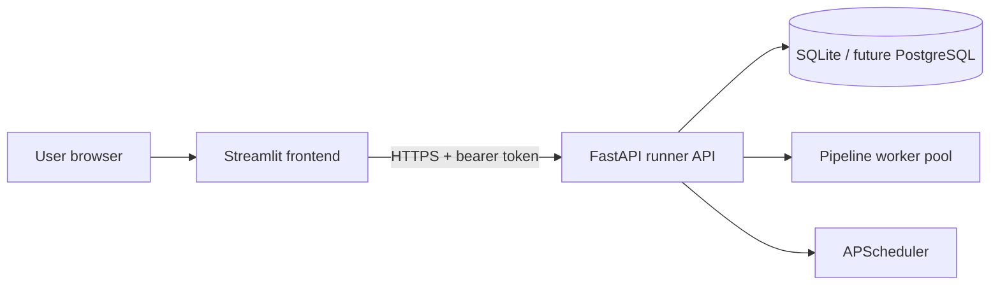

# Streamlit Frontend Implementation Plan

> **Status:** Phases 0–4 are implemented in `frontend/`. Phase 5 (visual graph
> builder) and several §11 backend enhancements remain future work. See
> [Streamlit UI](../streamlit-ui.md) for the current product docs.

## 1. Purpose

Build a Streamlit web application for the ETLantic Runner API that lets users:

- register, sign in, update their profile, and sign out;
- create, browse, inspect, edit, validate, plan, run, and schedule pipelines;
- monitor run status and inspect run reports;
- store and manage encrypted API tokens without exposing token values;
- grant tokens to individual pipeline bindings for read or write access;
- create groups, invite members, manage membership, and collaborate on shared
  pipelines;
- distinguish personal pipelines from pipelines shared through groups.

The Streamlit application is an API client. It must not import database models,
open the SQLite database, decrypt credentials, execute pipelines, or manipulate
APScheduler directly. FastAPI remains the only authority for authentication,
authorization, persistence, execution, and scheduling.

## 2. Product goals

### Primary goals

1. Make the complete API usable without curl or the OpenAPI console.
2. Provide a safe pipeline-editing workflow with explicit validation before
   save or run.
3. Make queued and scheduled executions easy to monitor.
4. Make token handling visibly safe: values are write-only and never rendered
   after submission.
5. Make ownership and group sharing understandable before users edit or delete
   anything.
6. Preserve API error details and concurrency conflicts in actionable UI
   messages.

### Non-goals for the first release

- Replacing FastAPI authorization with Streamlit-side authorization.
- Reading or writing the application database from Streamlit.
- Storing decrypted API tokens or user passwords in Streamlit state.
- Running pipelines inside the Streamlit process.
- A full node-and-edge graphical pipeline designer.
- Multi-user live co-editing, comments, or edit presence.
- Email delivery infrastructure for group invitations.
- Mobile-native layouts.

## 3. Current backend capabilities

The current API exposes 28 paths and supports these frontend workflows.

| Area | Relevant endpoints | Frontend use |
| --- | --- | --- |
| Health | `GET /health` | API connectivity indicator |
| Authentication | `POST /users`, `POST /auth/token` | Registration and login |
| Profile | `GET/PATCH/DELETE /users/me` | Profile and account settings |
| Pipelines | `POST/GET /pipelines`, `GET/PATCH/DELETE /pipelines/{id}` | Pipeline library and editor |
| ETLantic lifecycle | `POST /pipelines/{id}/edits`, `/validate`, `/plan` | Structured editing, validation, and plan preview |
| Runs | `POST /pipelines/{id}/runs`, `GET /runs`, `GET /runs/{id}` | Run submission and monitoring |
| Schedules | `POST /pipelines/{id}/schedules`, `GET /schedules`, `GET/PATCH/DELETE /schedules/{id}` | Schedule management |
| Tokens | `POST/GET /tokens`, `GET/PATCH/DELETE /tokens/{id}` | Write-only token creation and metadata management |
| Token grants | `POST/GET /pipelines/{id}/token-grants`, `DELETE /pipelines/{id}/token-grants/{grant_id}` | Bind credentials to source/sink assets |
| Groups | `POST/GET /groups`, `GET/PATCH/DELETE /groups/{id}` | Group library and settings |
| Membership | `GET /groups/{id}/members`, `DELETE /groups/{id}/members/{user_id}` | Member list, leaving, and owner removal |
| Invitations | `POST/GET /groups/{id}/invitations`, `DELETE /groups/{id}/invitations/{id}`, `POST /group-invitations/accept` | Invite and acceptance flows |
| Group pipelines | `PUT/GET/DELETE /groups/{id}/pipelines/{pipeline_id}` | Sharing and unsharing owned pipelines |

## 4. Recommended repository layout

Keep the frontend in this repository but isolated from the FastAPI package:

```text
frontend/
├── Home.py
├── pages/
│   ├── 01_Pipelines.py
│   ├── 02_Pipeline_Workspace.py
│   ├── 03_Runs.py
│   ├── 04_Schedules.py
│   ├── 05_API_Tokens.py
│   ├── 06_Groups.py
│   └── 07_Account.py
├── etlantic_ui/
│   ├── __init__.py
│   ├── api_client.py
│   ├── auth.py
│   ├── config.py
│   ├── errors.py
│   ├── models.py
│   ├── navigation.py
│   ├── polling.py
│   ├── state.py
│   ├── formatting.py
│   └── components/
│       ├── diagnostics.py
│       ├── pipeline_editor.py
│       ├── pipeline_summary.py
│       ├── run_status.py
│       ├── schedule_form.py
│       ├── token_form.py
│       └── group_members.py
└── tests/
    ├── test_api_client.py
    ├── test_auth_state.py
    ├── test_pipeline_workflows.py
    └── test_group_workflows.py
```

Add Streamlit and frontend test dependencies to `pyproject.toml`. Pin versions
in `uv.lock`, and expose a command such as:

```bash
uv run streamlit run frontend/Home.py
```

## 5. Architecture

### 5.1 Runtime topology



Streamlit communicates only over HTTP. Use a configurable base URL:

```dotenv
ETLANTIC_UI_API_URL=http://127.0.0.1:8000
ETLANTIC_UI_REQUEST_TIMEOUT_SECONDS=15
ETLANTIC_UI_RUN_POLL_SECONDS=2
```

Do not reuse `ETLANTIC_JWT_SECRET` or `ETLANTIC_TOKEN_ENCRYPTION_KEY` in the
frontend environment.

### 5.2 API client

Create one typed `EtlanticApiClient` wrapper around `httpx.Client`.

Responsibilities:

- prepend the configured API base URL;
- attach `Authorization: Bearer ...` when authenticated;
- apply connect/read timeouts;
- parse JSON responses into frontend Pydantic models;
- translate `401`, `403`, `404`, `409`, `410`, `422`, and `5xx` responses into
  UI-safe exception classes;
- avoid logging request bodies for login, registration, or token endpoints;
- expose one method per backend operation rather than arbitrary URL calls;
- handle `204 No Content` without attempting JSON parsing.

Suggested method groups:

```python
client.auth.login(...)
client.users.register(...)
client.pipelines.list(...)
client.pipelines.validate(...)
client.runs.submit(...)
client.schedules.create(...)
client.tokens.create(...)
client.groups.invite(...)
```

Generate or hand-maintain frontend response models from the checked-in OpenAPI
schema. Add a CI test that loads `app.openapi()` and detects missing client
coverage when backend paths change.

### 5.3 Session and authentication state

Store these values in `st.session_state`:

- access token;
- token expiration timestamp calculated from `expires_in`;
- current user metadata;
- selected pipeline, group, run, and schedule IDs;
- unsaved pipeline editor text and its base version/fingerprint;
- non-sensitive filter and pagination state.

Never store:

- passwords;
- submitted API-token values;
- the token-encryption key;
- backend JWT signing material;
- resolved ETLantic `SecretValue` objects.

On every authenticated page:

1. confirm an access token exists;
2. check its local expiry timestamp;
3. call `GET /users/me` when the session is initialized or uncertain;
4. clear authentication state and redirect to login after a `401`;
5. render a sign-out action that clears all user-specific session keys.

The backend currently issues access tokens but has no refresh-token endpoint.
The MVP should return users to the login form when a token expires. Silent
refresh must wait for a backend refresh-token design.

### 5.4 Caching

Use caching conservatively:

- cache API health for a few seconds;
- cache read-only lists for no more than 15–30 seconds;
- scope every user-data cache key by current user ID;
- invalidate relevant caches after every mutation;
- never cache login payloads, access tokens, API-token values, invitation
  acceptance tokens, or decrypted secrets;
- avoid global `st.cache_resource` clients that carry a user's bearer token.

## 6. Information architecture and pages

### 6.1 Public authentication screen

Use tabs for **Sign in** and **Create account**.

Sign in:

- email;
- password;
- submit to `POST /auth/token`;
- fetch `/users/me` after success;
- show a generic authentication error without revealing account existence.

Registration:

- email;
- display name;
- password and confirmation;
- client-side display of the 12-character minimum;
- submit to `POST /users`;
- either automatically sign in or switch to the login tab.

Also provide an **Accept group invitation** form. If an invite token is supplied
through a query parameter, copy it into session state, remove it from the
visible URL where supported, require authentication, then submit it to
`POST /group-invitations/accept`.

### 6.2 Home dashboard

Show:

- API health;
- personal/shared pipeline count;
- recent runs grouped by status;
- enabled schedule count and nearest next run;
- groups the user belongs to;
- quick actions for new pipeline, run history, new token, and new group.

All widgets should tolerate partial backend failure. A failure to load recent
runs should not prevent navigation to pipelines or account settings.

### 6.3 Pipeline library

`GET /pipelines` already returns both owned and group-shared pipelines.

The page should provide:

- table or cards with name, description, owner, version, update time, and
  validation/run status when locally available;
- filters for owned versus shared, name, owner, and group;
- a visible ownership badge;
- actions for open, validate, plan, run, schedule, share, and delete;
- delete only when `owner_id == current_user.id`;
- server-side `limit` and `offset` controls;
- a create-pipeline form accepting a sealed ETLantic JSON document.

Because `PipelineRead` does not currently include group context, the frontend
must correlate `GET /groups` and `GET /groups/{id}/pipelines` to label how a
pipeline was shared. Consider the backend improvement in section 11 before
optimizing this page.

### 6.4 Pipeline workspace

Use tabs or a segmented control:

1. **Overview**
2. **Definition**
3. **Diagnostics**
4. **Plan**
5. **Runs**
6. **Schedules**
7. **Credentials**
8. **Sharing**

#### Overview

- name, description, owner, version, fingerprint, and timestamps;
- personal or shared access indicator;
- source, transformation, and sink counts derived from the document;
- primary actions: validate, plan, run.

#### Definition editor

MVP:

- JSON text editor with syntax highlighting if a maintained Streamlit component
  is selected; otherwise use `st.text_area`;
- format JSON action;
- import/export JSON;
- client-side JSON parsing before API calls;
- save through `PATCH /pipelines/{id}` with `expected_version`;
- display version conflict (`409`) with choices to reload or copy unsaved text;
- never silently overwrite the local editor after a rerun.

The editor must preserve the backend fingerprint requirement. A user-edited
document may need to be resealed by an ETLantic authoring service before
`PATCH`. If the browser only has raw JSON, the preferred backend addition is a
dedicated “verify and seal draft” endpoint. Do not reproduce ETLantic
fingerprinting in JavaScript or frontend-only Python.

Structured edits can use `POST /pipelines/{id}/edits` with
`expected_token=fingerprint`. Begin with a small form for known edit commands
after cataloging the `EditCommand` operations supported by the installed
ETLantic release.

#### Diagnostics

- call `POST /pipelines/{id}/validate`;
- group diagnostics by severity;
- show code, message, and JSON path;
- link a diagnostic path back to the JSON editor where practical;
- disable or warn on run when validation reports errors.

#### Plan

- call `POST /pipelines/{id}/plan`;
- render summary tables for nodes, bindings, implementations, and regions;
- show the raw plan JSON in an expander;
- optionally render Mermaid if the plan exposes a safe graph projection;
- never assume plan JSON contains executable secrets.

#### Runs

- submit with `POST /pipelines/{id}/runs`;
- immediately show queued state and run ID;
- poll `GET /runs/{id}` every configured interval until terminal;
- stop polling when the user navigates away or the run becomes terminal;
- show status, timing, version/fingerprint snapshot, error, and report;
- provide a link to the global run page.

#### Schedules

- list schedules filtered by the selected pipeline;
- create cron, interval, or one-time schedules;
- use purpose-built fields instead of asking users to enter arbitrary JSON for
  common schedules;
- show the generated `trigger_args` JSON before save;
- support enable/disable, edit, and delete;
- show all datetimes with an explicit timezone.

#### Credentials

- list grants from `GET /pipelines/{id}/token-grants`;
- list only the current user's token metadata from `GET /tokens`;
- derive binding choices from pipeline node assets;
- require provider, optional location, and read/write operation;
- filter token choices by the requested permission;
- show only token name and masked last four characters;
- never display or request an existing token value;
- allow revocation only when the API permits it.

#### Sharing

- list groups the user belongs to;
- identify groups already containing the pipeline;
- allow adding/removing only if the current user owns the pipeline;
- link to the relevant group workspace;
- explain that group members may edit and run a shared pipeline but ownership
  remains with its creator.

### 6.5 Run history

- paginated `GET /runs`;
- filters for pipeline, status, schedule/manual source, and date;
- status badges for queued, running, succeeded, partial, and failed;
- expandable report JSON;
- auto-refresh toggle only while queued/running runs are visible;
- stable selected-run detail view.

The backend currently scopes runs to the user who initiated them. The UI should
not imply that all group members can view each other's run records.

### 6.6 Schedule management

- `GET /schedules` table;
- filter by pipeline, enabled state, and trigger type;
- edit and enable/disable actions;
- delete confirmation;
- show `next_run_at`;
- link back to the pipeline.

Schedules are owned by their creator, even when the pipeline is group-shared.
Make this clear in labels and empty states.

### 6.7 API-token vault

Token creation:

- name;
- token value in a password input;
- read and write toggles;
- confirmation that the value cannot be retrieved later;
- immediately clear the value widget and any related session state after a
  successful response.

Token list:

- name;
- masked suffix;
- read/write permissions;
- active state;
- last used and created timestamps;
- rotate, disable/enable, and delete actions.

Rotation:

- requires a new token value;
- `PATCH /tokens/{id}`;
- clear submitted value immediately;
- explain that grants continue to reference the same token ID.

Deletion:

- require confirmation;
- warn that related pipeline grants are removed by the backend.

### 6.8 Groups

Group library:

- cards with name, description, owner, and membership role;
- create group;
- open workspace.

Group workspace tabs:

1. **Pipelines** — group pipeline list and “add one of my pipelines.”
2. **Members** — role, display name, email, join date, owner removal actions,
   and leave-group action for ordinary members.
3. **Invitations** — invite email, pending/accepted/revoked/expired status,
   revoke pending invites.
4. **Settings** — owner-only rename, description, and delete.

Invitation delivery:

- the create endpoint returns `accept_token` once;
- present a copyable acceptance link immediately;
- do not place the token in cached data, logs, or later invitation tables;
- clearly state that the current application does not send email;
- add email delivery later through a backend integration, not Streamlit SMTP
  credentials.

### 6.9 Account

- current email and immutable user ID;
- update display name;
- password change with confirmation;
- sign out;
- deactivate account behind a typed confirmation.

For administrators, optionally display a separate user list based on
`GET /users`. Do not render or probe this endpoint for non-admin users.

## 7. Authorization-aware user experience

Frontend checks improve usability but never replace backend enforcement.

| Action | UI rule |
| --- | --- |
| View/edit shared pipeline | Current user owns it or receives it from `GET /pipelines` |
| Delete pipeline | `pipeline.owner_id == current_user.id` |
| Add/remove pipeline from group | Current user owns pipeline and belongs to group |
| Invite to group | Current user belongs to group |
| Remove another member | Current membership role is owner |
| Leave group | Current role is member, not owner |
| Edit/delete group | `group.owner_id == current_user.id` |
| Create token grant | Current user owns the selected token and can access pipeline |
| Revoke grant | Allow action; handle backend `403` if token/pipeline ownership does not permit it |
| View run/schedule | Only records returned by the authenticated API |

When metadata is insufficient to predict authorization, show the action only
in context and handle `403` cleanly. Do not infer access by decoding the JWT.

## 8. Error handling

Create a common error renderer:

| API response | UI treatment |
| --- | --- |
| `400/422` | Field or payload validation message |
| `401` | Clear auth state and return to login |
| `403` | “You do not have permission” without retry loops |
| `404` | Resource unavailable; it may have been deleted or access removed |
| `409` | Conflict UI; reload version/membership/invitation state |
| `410` | Expired invitation message |
| `429` | Backoff and retry guidance if rate limiting is added |
| `5xx` | Request ID if available and safe retry action |
| Network timeout | Preserve form/editor state and offer retry |

Never render raw Python exception traces in production. It is acceptable to
show structured ETLantic diagnostic messages returned by validation or plan
operations.

## 9. Testing strategy

### Unit tests

- API client request construction and response parsing;
- bearer-token attachment;
- `204` handling;
- error mapping;
- token-expiry calculations;
- editor-state preservation;
- schedule trigger serialization;
- role and ownership action visibility.

### Integration tests

Run Streamlit client services against the FastAPI `TestClient` or an ephemeral
Uvicorn server:

- register → login → current user;
- create → validate → plan → run pipeline;
- optimistic pipeline version conflict;
- create/rotate/disable/delete API token;
- create and revoke a pipeline token grant;
- create group → invite → accept → share → member edit;
- wrong-email and expired invitation handling;
- owner/member action boundaries;
- schedule create/edit/disable/delete.

### UI smoke tests

Use Streamlit's supported app-testing interface for:

- unauthenticated redirect;
- navigation after login;
- form validation;
- sensitive widget clearing;
- error banners;
- major page rendering with fixture data.

Add browser automation only for flows Streamlit's test interface cannot cover,
especially query-parameter invitation acceptance and rerun behavior.

### Security tests

- passwords and token values never appear in logs or snapshots;
- token fields clear after submission;
- one user's cached data never appears after another user signs in;
- bearer tokens are cleared on logout and `401`;
- invitation acceptance tokens are not cached;
- destructive actions require confirmation;
- UI does not expose token-encryption or JWT-signing configuration.

## 10. Delivery phases

### Phase 0 — Backend contract and scaffolding

Deliverables:

- export and review OpenAPI;
- create frontend package, configuration, API client, models, and error layer;
- add health check;
- add login, registration, logout, and guarded navigation;
- establish frontend tests and CI command.

Exit criteria:

- authenticated and unauthenticated navigation works;
- `401` clears state;
- no secret-bearing fields are logged.

### Phase 1 — Pipeline MVP

Deliverables:

- dashboard;
- pipeline library;
- create/read/update/delete;
- JSON definition editor;
- validate and plan views;
- run submission and polling;
- run history.

Exit criteria:

- a user can complete create → validate → plan → run without OpenAPI;
- unsaved JSON survives Streamlit reruns;
- version conflicts do not overwrite user work.

### Phase 2 — Schedules and credentials

Deliverables:

- schedule builder and management;
- token vault;
- token rotation and permissions;
- pipeline credential grants.

Exit criteria:

- token plaintext is never rendered after submission;
- all three schedule types can be created and edited;
- run execution can use a granted credential.

### Phase 3 — Groups and collaboration

Deliverables:

- group library/workspace;
- member and invitation management;
- acceptance-link flow;
- add/remove owned pipelines;
- owned/shared labeling and authorization-aware actions.

Exit criteria:

- invited user can join and edit a shared pipeline;
- members can add their own pipelines;
- non-owners cannot delete or unshare another user's pipeline.

### Phase 4 — UX hardening

Deliverables:

- accessibility and keyboard review;
- responsive layout pass;
- empty/loading/error states;
- API contract drift test;
- performance profiling and bounded caching;
- deployment documentation and observability.

Exit criteria:

- critical flows pass automated tests;
- frontend performs no direct persistence or execution;
- production configuration contains no backend secrets.

### Phase 5 — Visual pipeline builder

Prerequisites:

- backend authoring catalog/negotiation endpoints;
- stable list of supported ETLantic edit commands;
- draft sealing/fingerprinting endpoint;
- a decision on the graph-editor component and its maintenance/security posture.

Deliverables:

- node palette;
- edge and port editor;
- property inspector;
- diagnostic overlays;
- graph/JSON round-trip;
- safe save through backend ETLantic authoring operations.

## 11. Recommended backend enhancements

These are not blockers for the basic frontend, but they materially improve it.

1. **Refresh tokens or session exchange**  
   Avoid forcing login every 30 minutes while keeping short-lived access tokens.

2. **Current access metadata on pipelines**  
   Add fields such as `access_source`, `can_edit`, `can_delete`, and group IDs to
   `PipelineRead`. This avoids N+1 group correlation and brittle UI inference.

3. **Current membership role on groups**  
   Add `current_user_role` to `GroupRead`.

4. **Pagination metadata**  
   Return `{items, total, limit, offset}` for pipelines, runs, users, groups,
   schedules, and tokens.

5. **Run cancellation and server-driven progress**  
   Add cancellation plus Server-Sent Events or WebSockets before building
   richer live monitoring. Polling is sufficient for the MVP.

6. **Pipeline draft verification/sealing**  
   Accept an unsealed draft and return a canonical, fingerprinted ETLantic
   document plus diagnostics.

7. **Authoring catalog and edit schemas**  
   Expose ETLantic catalog/negotiation data needed by a visual builder.

8. **Invitation delivery**  
   Send acceptance links from a backend email integration and stop returning
   raw tokens to general-purpose UI code once delivery exists.

9. **Audit events**  
   Record group membership changes, pipeline edits, credential grants, runs,
   schedules, and destructive actions.

10. **Idempotency keys**  
    Support safe retries for create, invite, run, and schedule mutations.

11. **Consistent problem details**  
    Return a stable error envelope with code, message, field/path, and request
    ID.

12. **Pipeline revision history**  
    Store each saved pipeline revision and support comparison/restore.

## 12. Deployment plan

For local development:

```bash
# Terminal 1
uv run uvicorn etlantic_runner.api:app --reload

# Terminal 2
ETLANTIC_UI_API_URL=http://127.0.0.1:8000 \
  uv run streamlit run frontend/Home.py
```

For deployment:

- run FastAPI and Streamlit as separate processes/containers;
- route both through HTTPS;
- keep backend signing/encryption keys only in the FastAPI environment;
- configure Streamlit with only the API URL and non-sensitive UI settings;
- restrict FastAPI CORS only if the browser directly calls it; server-side
  Streamlit HTTP calls do not require browser CORS;
- add readiness checks for both services;
- use PostgreSQL and a single scheduler/runner leader before horizontal API
  scaling;
- set secure proxy headers and avoid logging authorization headers, passwords,
  invitation tokens, or API-token payloads.

## 13. Definition of done

The frontend release is complete when:

- every non-admin backend workflow has a usable Streamlit path;
- ownership and group access are clearly displayed;
- validation, plan, run, and schedule results are understandable without raw
  JSON, while raw JSON remains available for troubleshooting;
- API-token values are write-only and cleared immediately;
- access-token expiry and `401` behavior are deterministic;
- pipeline edit conflicts preserve unsaved work;
- invitation acceptance is single-use and email-bound;
- tests cover personal and shared pipeline workflows;
- OpenAPI/client drift is checked in CI;
- deployment docs keep all backend secrets out of Streamlit.
