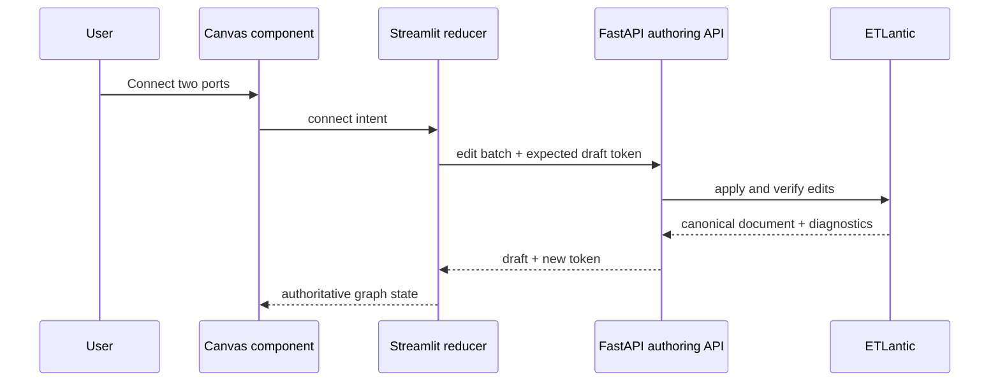

# Visual Pipeline Builder Product and Delivery Plan

> **Status:** Proposed for roadmap 0.5  
> **Depends on:** 0.2 sessions/API ergonomics, 0.3 revisions/run events, and
> 0.4 authoring platform  
> **Product promise:** A new user can build, validate, and run a useful ETLantic
> pipeline without reading JSON or learning ETLantic's internal document model.
> Delivery follows [Planning and Delivery Standards](delivery-standards.md).

## 1. Experience principles

The builder should feel like a focused data product, not a generic diagramming
tool.

1. **Guide before exposing complexity.** Start from intent, templates, and
   recommended defaults. Advanced fields and raw JSON remain available but are
   never the primary path.
2. **Make valid actions easiest.** Show compatible ports, legal connections,
   required fields, and available credentials before a user can reach a dead
   end.
3. **Keep the canvas calm.** Nodes show status and the minimum useful summary.
   Detailed configuration belongs in the inspector.
4. **Never lose work.** Maintain a local working draft, visibly report save
   state, recover interrupted sessions, and preserve both sides of a conflict.
5. **Explain problems where they occur.** Diagnostics attach to the node,
   port, edge, or field responsible and include a concrete next action.
6. **Make execution feel continuous.** Validation, planning, running, and run
   inspection happen from the same workspace without losing canvas context.
7. **Accessibility is a core interaction mode.** Every graph operation has a
   keyboard/list-view equivalent. Color never carries meaning alone.
8. **The API remains authoritative.** The frontend proposes edits; FastAPI and
   ETLantic validate, seal, authorize, persist, and execute them.

## 2. Target users and success journeys

### First-time builder

Starts from a recipe, chooses a source and destination, maps the required
fields, adds a credential grant, validates, and runs a sample. The UI explains
ETL concepts in plain language and reveals ETLantic terms only when useful.

### Data engineer

Starts from a blank canvas or imports JSON, searches a large component catalog,
edits parameters quickly, uses keyboard shortcuts, inspects contracts and the
execution plan, and switches to JSON for advanced changes.

### Collaborator

Opens a group-shared pipeline, understands ownership and edit permissions,
makes changes from a known revision, reviews the diff, and handles a concurrent
edit without overwriting another member's work.

### Operator

Opens a recent failed run, sees the failing node highlighted on the same graph,
reviews redacted logs and diagnostics, corrects the draft, and reruns it.

## 3. Workspace information architecture

Use a four-region desktop workspace:

```text
┌──────────────────────────────────────────────────────────────────────┐
│ Breadcrumbs · pipeline name · ownership · draft state · Validate Run│
├───────────────┬──────────────────────────────────┬───────────────────┤
│ Component     │                                  │ Inspector         │
│ palette       │          Graph canvas            │                   │
│ Search        │                                  │ Configuration     │
│ Sources       │                                  │ Ports / contract  │
│ Transforms    │                                  │ Credentials       │
│ Destinations  │                                  │ Diagnostics       │
├───────────────┴──────────────────────────────────┴───────────────────┤
│ Problems · Plan · Run output · Change summary                       │
└──────────────────────────────────────────────────────────────────────┘
```

- The left palette and right inspector are collapsible and resizable.
- The bottom panel opens only when it has useful content.
- The center canvas keeps its viewport and selection across Streamlit reruns,
  validation, tab changes, and non-destructive saves.
- On narrow screens, the palette and inspector become drawers. Small screens
  support viewing, configuration, validation, and run monitoring; complex
  graph layout is explicitly a desktop-first experience.
- A persistent command palette provides node search and common actions.

### Modes

Avoid separate pages for every lifecycle action. The workspace has four modes
that preserve the same graph and selection:

- **Build:** edit nodes, edges, settings, and credentials.
- **Review:** inspect change summary, diagnostics, contracts, and raw JSON.
- **Run:** submit a run and overlay live/terminal node status.
- **History:** choose a saved revision or prior run and project it on the graph.

## 4. Entry experience

The primary `New pipeline` action opens a short choice:

1. **Use a recipe** — recommended, with searchable goal-oriented templates such
   as file-to-database, API-to-file, and transform-and-load.
2. **Start from a source** — select a source first, then let the builder suggest
   compatible next nodes.
3. **Blank canvas** — for experienced users.
4. **Import JSON** — verify the document, show an import summary, then open it
   as an unsaved draft.

Recipe cards state required configuration, credentials, expected setup time,
and supported engines. Template instantiation creates a draft, not a persisted
pipeline, until the user confirms its name and first save.

For a first session, provide a dismissible three-step coach:

- add or choose a source;
- connect and configure the next node;
- validate and run.

Do not use a long product tour or modal sequence. Contextual tips disappear
after the associated action succeeds and can be restored from Help.

## 5. Canvas interaction model

### Nodes

Each node card shows:

- icon, plain-language label, and stable node name;
- node kind: Source, Transform, Destination, or Subpipeline;
- one-line asset/transformation summary;
- input ports on the left and output ports on the right;
- configuration completeness and validation/run status;
- a credentials-required indicator without token names or values;
- an overflow menu for duplicate, disable if supported, disconnect, and delete.

Node color is a secondary kind cue. Shape/icon and text provide the same
information. Selected, hovered, invalid, running, and disabled states must be
visually distinct and meet WCAG AA contrast.

### Adding nodes

Support all of these paths:

- drag from the palette;
- click a palette item, then click its canvas position;
- use the command palette;
- drag from an unconnected output into empty space and choose from compatible
  downstream components;
- click an empty-canvas `Add first source` call to action.

New nodes receive human-readable unique names. The name is editable, but a
rename must use an explicit backend operation once ETLantic supports it; the UI
must not simulate rename as delete-and-recreate.

### Connecting ports

- Begin a connection by dragging or activating a port with the keyboard.
- While connecting, emphasize compatible targets and de-emphasize incompatible
  ones.
- Hovering a port shows its direction, required/optional status, type,
  contract, and whether it is already bound.
- Reject self-loops, wrong direction, unavailable single-input ports, and
  provably incompatible contracts immediately.
- If compatibility is uncertain, allow the draft edge but mark it `Needs
  validation`.
- Dropping on a node with one compatible port connects directly; multiple
  choices open a small port picker.
- Selecting an edge exposes contracts, disconnect, and insert-node actions.
- `Insert transform` on an edge filters the palette to compatible transforms
  and rewires only after the backend accepts the edit batch.

### Selection, layout, and scale

- Click selects one item; Shift-click multi-selects.
- Box selection, pan, zoom, zoom-to-fit, and center-on-selection are required.
- Delete requires confirmation only when it removes configured nodes or
  multiple edges; simple edge deletion supports immediate undo.
- Provide undo/redo for the current draft using accepted edit commands, with
  keyboard shortcuts and readable action labels.
- Offer deterministic auto-layout with left-to-right as the default. Manual
  coordinates are UI metadata and must not affect ETLantic fingerprints unless
  ETLantic formally includes layout metadata in its canonical schema.
- Large graphs support a minimap, collapsed subpipelines, and search-to-focus.
- Do not virtualize until profiling identifies a need; set an initial product
  target of smooth interaction at 100 nodes and 200 edges on a typical laptop.

## 6. Component palette and catalog

The palette is driven entirely by the backend authoring catalog. It groups
components by user intent:

- Sources
- Transforms
- Destinations
- Subpipelines
- Recently used
- Favorites

Search indexes display name, description, capability, engine, data type,
provider, and common synonyms. Filters include compatible-with-selection,
engine, provider, deprecated status, and credential requirement.

Catalog entries need enough UI-safe metadata to render a useful choice:

- stable identity and version;
- kind and display metadata;
- input, output, and parameter definitions;
- field types, defaults, constraints, examples, and choices;
- contract compatibility information;
- configuration schema and conditional visibility rules;
- credential requirements expressed as scopes/capabilities, never secrets;
- deprecation/replacement information;
- documentation URL from an allow-listed scheme;
- icon key from an application-controlled icon set, not arbitrary markup;
- catalog ETag/version for caching and draft reproducibility.

If a saved pipeline references a missing catalog entry, render an `Unavailable
component` node that preserves the document and explains why it cannot run.
Never silently remove or rewrite it.

## 7. Inspector and guided configuration

Selecting a node opens an inspector organized in this order:

1. **Setup** — required, common fields with plain-language labels.
2. **Data** — asset, contract, schema, input/output, and mapping controls.
3. **Credentials** — eligible token grants and required read/write scope.
4. **Advanced** — engine-specific settings and raw values.
5. **About** — component identity, version, documentation, capabilities.

Forms are generated from backend schemas but use curated UI hints for field
order, widgets, help text, grouping, and examples. Schema generation must never
degrade into a giant undifferentiated JSON form.

Configuration behavior:

- required fields are clearly marked before submission;
- defaults are visible and distinguishable from explicitly saved values;
- units appear beside numeric fields;
- URL/path examples reflect the component;
- dependent fields appear only when relevant;
- edits validate locally for responsiveness and authoritatively on the server;
- changing a setting that invalidates edges previews the impact and asks for
  confirmation;
- node deletion lists affected connections;
- every destructive configuration change supports undo within the draft.

### Data mapping

Where contracts expose fields, provide a dedicated mapping editor rather than
forcing users to type binding JSON:

- source fields on the left, destination fields on the right;
- automatic exact-name/type suggestions;
- search and filters for unmapped, required, incompatible, and transformed;
- drag/connect and accessible dropdown alternatives;
- inline type compatibility and required-field diagnostics;
- expression editing only when the selected transform supports it;
- a compact summary on the node after the inspector closes.

## 8. Credentials and secret safety

The builder consumes only token metadata and grant IDs.

- A field that requires credentials offers eligible stored tokens filtered by
  required read/write scope.
- Users can open `Create token` in a contained flow and return to the same node;
  plaintext is cleared immediately after submission.
- The graph document stores no token value. Prefer grant references maintained
  by the runner database rather than embedding even token metadata in the
  canonical pipeline document.
- The inspector says which asset and permission a grant enables without
  exposing the token value.
- Copy, export, JSON view, diagnostics, analytics, browser logs, and error
  reporting must never contain secret plaintext.
- Revoked or insufficient grants appear as node-level blocking diagnostics with
  a `Choose credential` action.

## 9. Validation, diagnostics, and planning

Use a two-level feedback loop:

- **Immediate checks:** required fields, duplicate names, port direction,
  obvious type mismatch, and disconnected required inputs.
- **Authoritative verification:** debounce server verification after a short
  idle period and always verify before save or run.

Diagnostics need stable identifiers and locations:

```json
{
  "code": "contract.type_mismatch",
  "severity": "error",
  "message": "Destination expects an integer.",
  "suggestion": "Add a cast transform or change the mapping.",
  "location": {
    "node": "load_customers",
    "port": "input",
    "field": "customer_id"
  }
}
```

Presentation rules:

- node/port/edge badges show local problem counts;
- the Problems panel groups errors, warnings, and suggestions;
- selecting a problem focuses the graph and opens the correct inspector field;
- messages explain impact and next action, not Python exceptions;
- warnings can be acknowledged but remain visible;
- save may permit a structurally valid draft with warnings; run requires the
  backend's runnable result;
- stale diagnostics are labeled and removed when their draft fingerprint no
  longer matches.

The Plan panel translates planner output into a readable sequence: execution
engine, materialization boundaries, estimated stages, capability fallbacks,
and warnings. Raw plan JSON remains downloadable under an advanced disclosure.

## 10. Drafts, saving, conflicts, and JSON round-trip

Maintain three explicit states:

- **Saved revision:** server document, version, and fingerprint.
- **Working draft:** last server-accepted sequence of authoring edits.
- **Pending gesture:** local interaction not yet accepted by the backend.

Send edit commands after meaningful gestures, not every mouse movement. Batch
atomic gestures such as inserting a node into an edge. The server returns the
canonical document, new draft fingerprint/concurrency token, and diagnostics;
that response replaces the frontend's inferred graph state.

The header always shows one of:

- Saved
- Saving draft…
- Unsaved changes
- Offline — changes retained locally
- Conflict — review required
- Read only

Autosave the working draft to a server-side draft resource. Local browser or
Streamlit state is only a short-lived recovery buffer. Persist the pipeline
revision when the user selects **Save version**, and verify again before the
commit.

On a `409`:

1. freeze automatic saves;
2. retain the user's draft and fetch the latest saved revision;
3. show changes grouped by nodes, edges, and settings;
4. allow `Use latest`, `Keep my draft as a copy`, or manual resolution;
5. never silently replay destructive commands against a changed graph.

### JSON mode

JSON is an expert view of the same draft, not a separate editor:

- switching to JSON serializes the current canonical draft;
- applying JSON calls `verify-draft`, then replaces the graph only if a
  canonical document is returned;
- show a structural change summary before applying;
- preserve unknown supported fields through every graph edit;
- round-trip tests must prove `graph → canonical JSON → graph` stability;
- canvas layout is stored separately so formatting changes do not alter the
  pipeline fingerprint.

## 11. Run and debugging experience

The primary run action is a split button:

- **Run pipeline**
- **Run with options** for supported runtime parameters
- **Validate only**

Before submission, show blocking problems and a concise confirmation including
pipeline version, environment if introduced later, and credential readiness.

During a run:

- overlay queued/running/succeeded/partial/failed state on each node;
- animate only the active path and honor reduced-motion preferences;
- keep an event timeline in the bottom panel;
- allow cancellation when the backend supports it;
- reconnect to server-driven events after a transient disconnect, with polling
  as fallback.

After a run:

- focus the first failure while preserving the full status map;
- display redacted node diagnostics, duration, row/record metrics when
  available, and retry guidance;
- offer `Edit and rerun`, which returns to Build mode at the failing node;
- make clear that editing creates a new draft and does not mutate the historical
  run snapshot.

## 12. Collaboration and permissions

- Show owner/group context beside the pipeline name.
- Read-only users can pan, inspect, validate if authorized, export, and view
  history, but never see controls that imply edits will save.
- Editors see who saved the current revision and when.
- A lightweight presence hint may say another member is editing, but
  fingerprint/version conflicts remain the correctness mechanism.
- Save version can request an optional change summary.
- Revision history shows author, timestamp, summary, fingerprint, and visual
  changes. Restore creates a new revision; it never erases history.
- Sharing, membership, tokens, and runs remain API-authorized. Hiding a control
  is UX, not authorization.

## 13. Accessibility and keyboard design

Required keyboard operations:

- move focus between canvas, palette, inspector, and Problems panel;
- search and add a node;
- traverse nodes and their ports in graph order;
- connect two ports without dragging;
- open/configure, duplicate, and remove a selected node;
- undo/redo, save, validate, run, zoom, and focus selection;
- escape the current gesture or close a panel.

Provide an **Outline view** representing the graph as an accessible ordered
list/tree. It exposes node settings and connections and supports the same
authoring commands as the canvas. Announce save state, validation results, run
state, and connection success/failure through an ARIA live region.

Test at 200% zoom, with screen readers, keyboard only, high contrast, and
reduced motion. Tooltips cannot contain required information that is otherwise
unavailable.

## 14. Technical approach

Streamlit remains the page shell, authentication client, and lifecycle UI. The
canvas should be a dedicated bidirectional Streamlit component implemented
with a maintained graph library rather than rerendering static Mermaid.

Evaluate candidates using a proof of concept, not feature checklists:

- typed custom nodes and ports;
- keyboard accessibility and an API that permits an Outline view;
- deterministic controlled state;
- viewport preservation across Streamlit reruns;
- 100-node/200-edge interaction performance;
- connection constraints and custom edge states;
- event batching over the Streamlit component bridge;
- maintained releases, acceptable license, dependency footprint, and security
  response history;
- theming, high contrast, and reduced motion;
- no requirement to send pipeline data to a third-party service.

Keep a framework-independent Python `BuilderState`/`BuilderReducer` layer
between component events and the API client. It owns selection, viewport,
pending gestures, accepted draft fingerprint, diagnostics, undo/redo metadata,
and save state. The component renders state and emits intents; it does not
author or seal ETLantic documents.



## 15. Required backend contracts

Add or formalize:

1. `GET /authoring/capabilities` — ETLantic/catalog/document versions and
   supported lifecycle/edit operations.
2. `GET /authoring/catalog` — filterable, versioned entries with port and form
   schemas; support ETag.
3. `POST /pipeline-drafts` — create from blank, recipe, import, or pipeline
   revision.
4. `GET/DELETE /pipeline-drafts/{id}` — resume or discard.
5. `POST /pipeline-drafts/{id}/edits` — accept one atomic edit batch and an
   expected draft concurrency token.
6. `POST /pipeline-drafts/{id}/verify` and `/plan` — return diagnostics tied to
   the resulting draft fingerprint.
7. `POST /pipeline-drafts/{id}/commit` — save a new pipeline or update an
   existing one with its expected persisted version.
8. `GET /pipelines/{id}/revisions` and revision compare/restore endpoints.
9. Recipes endpoint or versioned application-owned recipe catalog.

Edit schemas must cover add, remove, connect, disconnect, update, clone, move,
and an atomic batch. Before promising rename, node disablement, or graph layout
in the UI, add explicit schema support rather than encoding behavior through
unrelated operations.

Backend responses should return stable problem details and never require the
UI to parse exception text. Mutating calls should accept idempotency keys.

## 16. Delivery slices

### 0.5.0 — Readable graph

- interactive read-only canvas for existing pipelines;
- node/edge selection, inspector, zoom-to-fit, minimap, and Outline view;
- diagnostics and run-result overlays;
- catalog/capability negotiation;
- performance and accessibility baseline.

**Gate:** Every existing supported document renders without data loss; missing
components degrade safely; keyboard users can inspect the full graph.

### 0.5.1 — Guided authoring

- blank/recipe/import entry paths;
- palette, add/remove/configure, compatible connections;
- server-side draft resource and atomic edit batches;
- guided forms, mapping editor, credential-grant selection;
- undo/redo and deterministic auto-layout.

**Gate:** In usability testing, at least 8 of 10 target users can create a
valid source-transform-destination pipeline without editing JSON or receiving
assistance.

### 0.5.2 — Safe saving and expert workflows

- autosave/resume, explicit version commits, conflict resolution;
- JSON round-trip and structural change review;
- revision history integration;
- keyboard shortcuts and command palette;
- large-graph profiling and tuning.

**Gate:** Refresh/crash recovery loses no server-accepted edit; concurrency
tests prove that one user cannot overwrite another; round-trip fixtures retain
all supported document fields.

### 0.5.3 — Run-centered polish

- live run overlays and event timeline;
- failure-to-node navigation and edit/rerun;
- cancellation when supported;
- onboarding, empty states, refined responsive behavior, product analytics.

**Gate:** Users can diagnose and correct representative node/connection errors
from localized guidance, and the p95 edit acknowledgement remains under 500 ms
on the supported deployment profile.

## 17. Testing strategy

### Contract and model tests

- catalog and edit schemas stay aligned with OpenAPI and installed ETLantic;
- every supported node/port/contract shape has a rendering fixture;
- reducer tests cover each intent, out-of-order response, retry, and conflict;
- property-based graph/JSON round-trip and edit-sequence tests;
- unknown fields and missing catalog identities are preserved.

### Component tests

- selection, connection rules, keyboard graph traversal, layout persistence;
- inspector validation and conditional fields;
- diagnostic-to-element focus;
- undo/redo and atomic multi-step gestures;
- secret redaction in component events and snapshots.

### End-to-end tests

- recipe → configure → credential grant → validate → save → run;
- import JSON → graphical edit → JSON export;
- group-shared concurrent edit and resolution;
- reload/offline recovery;
- failed run → highlighted node → correction → rerun;
- read-only user and revoked credential behavior.

Run automated accessibility checks, but retain manual keyboard and screen-reader
acceptance testing. Capture performance traces for small (10/20), medium
(50/100), and target-large (100/200) node/edge fixtures.

## 18. Product quality metrics

Instrument only non-sensitive interaction metadata with user consent and
redaction:

- time to first valid pipeline;
- completion and abandonment by entry path;
- validation errors per successful first run;
- percentage of pipelines built without JSON mode;
- autosave/recovery and conflict rates;
- p50/p95 edit acknowledgement and canvas interaction latency;
- failure-to-success time after a run error;
- keyboard-only task completion;
- support requests grouped by builder stage.

Initial quality targets:

- median first valid pipeline under 10 minutes for a recipe flow;
- at least 80% unassisted first-run completion in moderated target-user tests;
- at least 95% of common pipelines completed without raw JSON;
- no known critical accessibility violations;
- zero secret values in frontend telemetry, logs, snapshots, or exports;
- no lost server-accepted edits in resilience testing.

## 19. Explicit non-goals for 0.5

- free-form code execution or arbitrary Python inside nodes;
- full CRDT multiplayer editing;
- mobile-first graph construction;
- frontend-defined components not present in the backend catalog;
- bypassing ETLantic validation, sealing, or FastAPI authorization;
- embedding secret values in pipeline documents;
- building a general-purpose drawing/diagramming application.

## 20. Definition of done

The visual builder is ready for general use when:

- a novice can create, understand, validate, save, and run a supported pipeline
  without JSON;
- all supported graph actions have keyboard and Outline-view equivalents;
- server drafts recover after reload and conflicts cannot silently overwrite;
- diagnostics reliably focus the responsible graph element and configuration
  field;
- credentials are grant-only and secret-safe through every builder flow;
- graph/JSON round-trip preserves canonical ETLantic documents;
- existing pipeline permissions, versioning, groups, schedules, and run
  snapshots remain correct;
- component security, accessibility, resilience, and target-scale performance
  pass their release gates.

## 21. Open decisions and risk register

Resolve these before 0.5.0 implementation:

| Decision/risk | Required evidence or mitigation | Trigger/owner |
| --- | --- | --- |
| Graph component accessibility or maintenance is inadequate | Build the controlled-state/keyboard/performance proof of concept in §14 and record an ADR | Builder technical lead before dependency selection |
| Streamlit component reruns lose viewport or gestures | Prototype event batching and restoration with 100/200 fixture; retain structured Outline view as the complete fallback | 0.5.0 spike |
| ETLantic authoring contract changes | Pin PyPI version, use only public authoring APIs, and run catalog/edit parity fixtures on upgrades | Every dependency update |
| Canvas metadata changes canonical fingerprints | Store layout separately until ETLantic explicitly defines canonical layout semantics | Draft API design |
| Large forms become schema dumps | Require curated UI hints and usability acceptance for every first-party catalog entry | Catalog review |
| Credentials leak through component events or diagnostics | Use grant IDs only and run secret-canary tests across browser/component/API boundaries | Every 0.5.x gate |
| Visual editing excludes keyboard/screen-reader users | Outline view must reach operation parity before writable canvas ships | 0.5.1 release |

The component ADR must decide library, license, controlled-state model,
accessibility posture, dependency update policy, and fallback/removal strategy.
